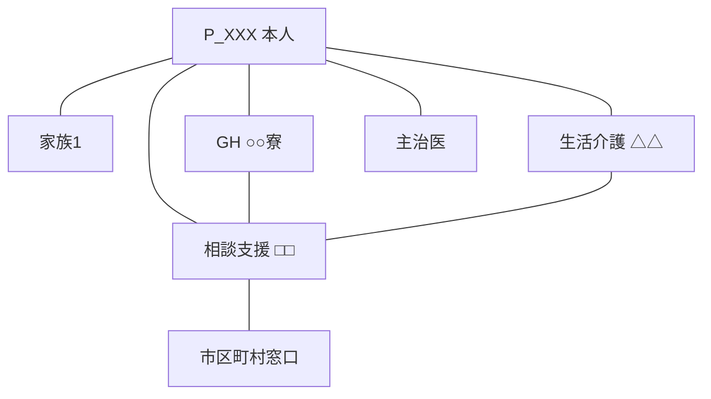

# {{本人氏名}} のエコマップ — {{用途}} ({{YYYY-MM}})

> エコマップは支援ネットワークのスナップショットです。月単位で更新し、本人を取り巻く関係性の変化を時系列で追えるようにします。
> 図は下の mermaid を手で編集しても、作図ツールやAIで生成してもかまいません。

## 用途

- [ ] current — 現況把握
- [ ] handover — 引き継ぎ用
- [ ] crisis — 緊急時連絡網
- [ ] meeting — 支援会議資料

## ネットワーク図

## 関係性の質（凡例）

- 太線: 強い関係（日常的に密に関わる）
- 細線: 通常の関係
- 点線: 弱い関係 / 緊張関係
- 双方向矢印: 相互的な関係
- 一方向矢印: 一方的な支援・依存

## ノード詳細

### 本人 P_XXX
→ [[P_XXX_氏名]]

### 関わる人物・組織

- [[E_GH...]]: 居住の場
- [[E_...]]: 日中活動
- ...

## 変化点（前回スナップショットからの差分）

（前月との変更がある場合に記載。新規追加・関係性変化・終了等）

## 想定される将来の移行

（今後追加・変更が予想されるノード。例: 親なき後の引き継ぎ先候補）
