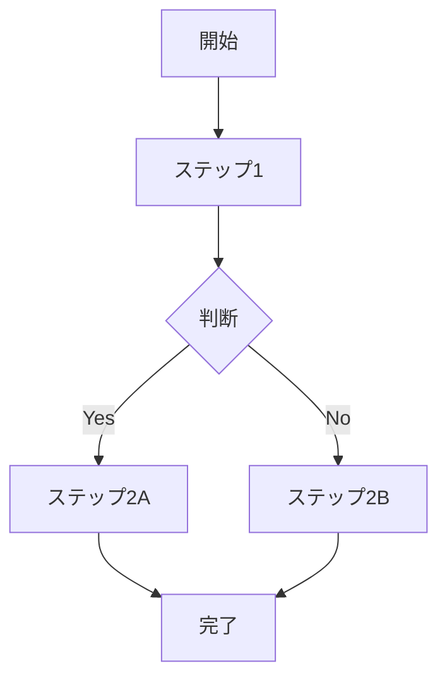

# {{手続き名}}

> Procedure ページは「困ったときに最短で動けるための手順書」です。本文は箇条書き・フローチャート中心で、解説は最小限に。

## 適用条件

（いつこの手続きが必要になるか）

## 必要なもの・前提

- 書類: ...
- 連絡先: → `raw/legal/contacts.md`
- 想定所要時間: ...

## 手順

### ステップ詳細

1. **ステップ1**: ...
2. **ステップ2**: ...

## 緊急連絡先（crisis 用フローの場合）

（最優先の連絡先順）

1. ...
2. ...

## 関連 Public System

- [[PS_...]]

## 関連 Entity

- [[E_...]]

## 過去の事例・申し送り

（過去にこの手続きを行った際の Trial / 学び）

- [[T_..._P_XXX]]
