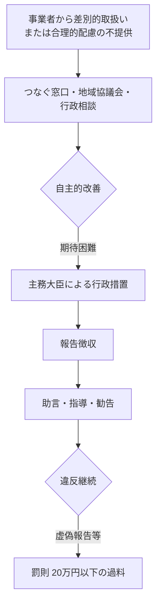

# 障害者差別解消法

> **ひとことで**：障害を理由とする差別を禁じ、合理的配慮の提供を求める法律。**令和6年4月から民間事業者にも合理的配慮が法的義務化**。
>
> 📅 **確認日 2026-06-14** ／ ⚠️ 運用・相談窓口は分野・自治体で異なります。

> 正式名称「障害を理由とする差別の解消の推進に関する法律」。**令和6年4月1日から民間事業者にも合理的配慮の提供が法的義務化**。GH・生活介護事業所等への合理的配慮請求の根拠であり、本人が他者と平等に暮らすための重要な法的基盤。

## 1. 法律の概要・沿革

| 項目 | 内容 |
|------|------|
| 正式名称 | 障害を理由とする差別の解消の推進に関する法律 |
| 制定 | 平成25年（2013年）6月 |
| 施行 | 平成28年（2016年）4月1日 |
| 改正 | 令和3年（2021年）5月成立 |
| **改正法施行** | **令和6年（2024年）4月1日** |

### 主要な変更（2024年4月）

事業者による**合理的配慮の提供**: **「努力義務」 → 「義務」**

### 目的

全ての国民が障害の有無によって分け隔てられることなく、相互に人格と個性を尊重し合いながら共生する社会の実現に向け、障害を理由とする差別の解消を推進。

## 2. 不当な差別的取扱いの禁止

### 定義

障害者に対して、**正当な理由なく**、障害を理由として:
- 財・サービスや各種機会の提供を拒否する
- 提供に当たって場所・時間帯などを制限する
- 障害者でない者に対しては付さない条件を付ける

### 義務主体

行政機関等と民間事業者**双方が法的義務**（合理的配慮と異なり、当初から義務）。

「事業者」には**社会福祉法人やNPO法人**も含まれる。

## 3. 合理的配慮の提供義務（最重要） ⚠️

### 定義

> 障害のある方が日常生活や社会生活で受ける様々な制限をもたらす原因となる**社会的障壁**を取り除くために、障害のある方に対し、**個別の状況に応じて行われる必要かつ合理的な配慮**

### 義務主体（時期別）

| 時期 | 行政機関等 | 民間事業者 |
|------|-----------|-----------|
| 〜令和6年3月31日 | 法的義務 | 努力義務 |
| **令和6年4月1日〜** | 法的義務 | **法的義務** |

### 「過重な負担」の判断要素

総合的・客観的に判断:
1. 事務・事業への影響の程度
2. 実現可能性の程度（物理的・技術的・人的・体制上）
3. 費用・負担の程度
4. 事務・事業規模
5. 財政・財務状況

過重な負担に当たると判断した場合は、**障害者に理由を説明**し理解を得るよう努める。

### 「建設的対話」の重要性

合理的配慮は、双方の**建設的対話による相互理解**を通じて、必要かつ合理的な範囲で柔軟に対応がなされる。

### 合理的配慮の典型例

- 物理的環境への配慮（段差・スロープ等）
- 意思疎通の配慮（筆談、読み上げ、手話、分かりやすい表現）
- ルール・慣行の柔軟な変更（休憩時間の調整等）
- 絵や写真のカード・タブレット端末の使用
- 自筆が難しい場合の代筆

## 4. 環境の整備（事前的改善措置）

### 合理的配慮との違い

| 項目 | 合理的配慮 | 環境の整備 |
|------|-----------|-----------|
| 対象 | 個々の障害者 | 不特定多数の障害者 |
| タイミング | 個別の状況に応じて | 事前に |
| 例 | 個別場面でのスロープ | バリアフリー化、人的支援、情報アクセシビリティ向上 |

合理的配慮は、環境の整備を**基礎として提供される個別の対応**。

## 5. 基本方針と対応指針

### 内閣府の基本方針（令和5年3月14日改定）

政府全体の方針。改定版のポイント:

- 不当な差別的取扱い・合理的配慮の提供に関する例の追加
- 事業者と障害者双方の「建設的対話」「相互理解」の重要性
- 「**つなぐ役割**」を担う国の相談窓口（つなぐ窓口）の設置

### 関係府省庁の対応指針

各事業分野を担当する主務大臣が、事業者向けに作成。改正法施行に伴い順次更新中。

該当: 内閣府、国家公安委員会、金融庁、消費者庁、復興庁、こども家庭庁、総務省、法務省、外務省、財務省、文部科学省、**厚生労働省**、農林水産省、経済産業省、国土交通省、環境省。

### 条例との関係

地方公共団体の条例（**上乗せ・横出し条例**を含む）は引き続き効力。新たな制定も可能。

## 6. 紛争解決の仕組み

### 相談窓口

- 既存の行政相談・人権相談などを活用
- **「つなぐ窓口」**: 国に設置された、相談事案を適切な自治体や府省庁等の窓口につなぐ窓口

### 障害者差別解消支援地域協議会

地域レベルで組織されるネットワーク。「**たらい回し**」防止が狙い。都道府県協議会は市町村協議会を補完・支援。

### 主務大臣による行政措置

事業者が自主的改善を期待することが困難な場合:

```
報告徴収・助言・指導・勧告
   ↓ 違反継続
報告求めへの虚偽報告・報告怠り
   ↓
罰則（20万円以下の過料）
```

## 7. 知的障害支援における合理的配慮

### 知的障害のある方への合理的配慮の典型例

- 意思を伝え合うための絵や写真のカード・タブレット端末の使用
- わかりやすい表現を使った説明
- 自筆が難しい場合の代筆
- 障害の特性に応じた休憩時間の調整

### 「意思の表明」が困難な場合の家族・支援者からの表明 ⚠️

**法律上の解釈**:

> 知的障害や精神障害（発達障害を含む）等により本人の意思表明が困難な場合には、**障害者の家族、介助者等、コミュニケーションを支援する者が本人を補佐して行う意思の表明も法律上の「意思の表明」に含まれる**

さらに、家族・介助者を伴っていない場合でも、社会的障壁の除去を必要としていることが**明白である場合**には、配慮を提案するために**建設的対話を働きかけるなど自主的な取組に努めることが望ましい**。

### 障害福祉サービス事業所での合理的配慮

合理的配慮の提供義務を負う「事業者」には、社会福祉法人や特定非営利活動法人のような非営利事業を行う者も含まれる。

- グループホーム
- 生活介護事業所
- 就労継続支援事業所
- 短期入所事業所

を運営する法人も、令和6年4月以降は**合理的配慮を提供する法的義務**を負う。

## 8. グループホーム等への注記（基本方針より）

> 国は、グループホーム等を含む、障害者関連施設の認可等に際して、**周辺住民の同意を求める必要がない**ことを十分に周知する

地方公共団体においても、住民の理解を得るための啓発活動を行うことが望ましい。

## 親なき後支援の文脈での活用ポイント

### 民間事業者への合理的配慮請求の根拠

[[PS_障害福祉サービス体系]] のサービスを提供する事業者（GH・生活介護等）は、令和6年4月以降は**法的義務**として合理的配慮を提供する。本人の特性に応じた支援が不十分な場合、本法を根拠に建設的対話を求めることができる。

### 商業施設・公共交通機関への配慮

法の対象分野には公共交通や店舗が含まれる。本人の地域生活で利用する場面（電車・バス・買い物・余暇）での合理的配慮の根拠となる。

### 紛争解決経路



### 雇用分野は別法

労働者に対する差別解消は**障害者の雇用の促進等に関する法律**（昭和35年法律第123号）が定める。

## 関連 Concept

- [[C_合理的配慮]]: 合理的配慮の概念整理（食支援等の具体場面含む）
- [[CD_意思決定支援]]: 意思の表明が困難な場合の家族・支援者の役割

## 関連する公的システム

- [[PS_障害者虐待防止法]]: 差別と虐待の境界
- [[PS_障害福祉サービス体系]]: 民間事業者としての障害福祉サービス事業所

## 相談・関連先

- 内閣府 障害者政策担当
- 国の相談窓口「つなぐ窓口」、お住まいの自治体の障害者差別相談窓口・障害者差別解消支援地域協議会

## 公式情報（最新はこちらで確認）

- 内閣府 障害を理由とする差別の解消の推進: https://www8.cao.go.jp/shougai/suishin/sabekai.html
- 内閣府 基本方針本文: https://www8.cao.go.jp/shougai/suishin/sabekai/kihonhoushin/honbun.html
- 内閣府 改正障害者差別解消法が施行されました（2024.5.20）: https://www.cao.go.jp/press/new_wave/20240520.html
