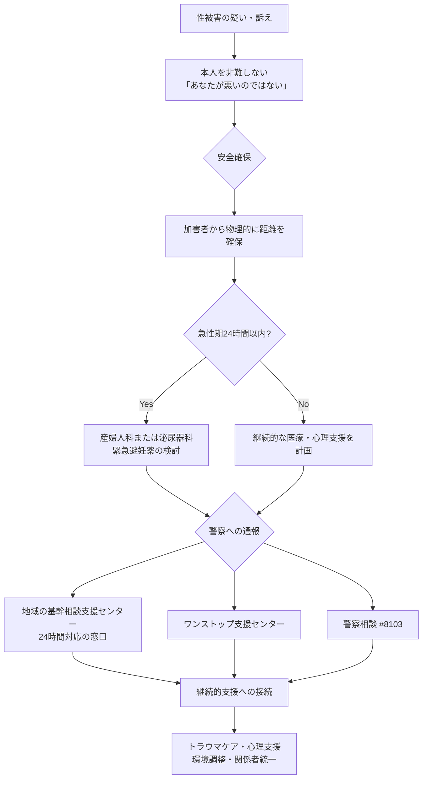

# 性被害時の対応フロー

> **ひとことで**：本人が性被害を受けた疑いがあるときの、最短で動くための手順。**最重要原則：「被害に遭うことは決して本人のせいではない」**。
>
> 📅 **確認日 2026-06-14** ／ ⚠️ 地域の窓口（ワンストップ支援センター名・電話）はお住まいの地域のものを事前に調べて書き加えてください。地域版の例 → [[親なき後の窓口経路（北九州市の記入例）]]

> 「困ったときに最短で動けるための手順書」。本人が性被害を受けた疑いがある場合の支援者・家族の標準対応フロー。**最重要原則: 「被害に遭うことは決して本人のせいではない」**。

## このページの目的

- **本人を被害から守るため**（第一の柱）
- **二次被害を防止するため**（本人を責めない・適切な相談先につなぐ）

## 適用条件

- 本人が性被害を受けた、または受けた疑いがある場面
- 本人が「嫌な触られ方をした」「変なことをされた」と訴えた場面
- 本人の様子から被害が疑われる場面（突然の落ち込み・身体的痕跡・生活の急変等）

## 必要なもの・前提

### 関係者間の事前共有事項

- 本人の主治医・かかりつけ医
- 地域の**基幹相談支援センター**の連絡先（多くは24時間対応）
- **#8103**（性犯罪相談ダイヤル）／**#8891**（性暴力被害ワンストップ支援センター）
- お住まいの地域の性暴力被害者ワンストップ支援センターの連絡先（事前に調べておく）
- 本人の意思を代弁できる成年後見人・家族の連絡先

## 1. 全体フロー

## 2. 最優先: 「本人は悪くない」のメッセージ

支援者向け性教育ガイドが繰り返し強調する**最重要原則**:

> **被害に遭うことは決してあなたのせいではない**ということです。どんな理由があっても、人に無理やり性的な行為をする方が100%悪いのです。

### 本人へ伝える言葉

- 「あなたは悪くない」
- 「話してくれてありがとう」
- 「相手が悪い」
- 「一緒に考えよう」

### 言ってはいけない言葉（二次被害）

- 「どうしてついて行ったの？」
- 「断らなかったの？」
- 「証拠はあるの？」
- 「忘れた方がいい」

## 3. 急性期対応（被害発生から72時間以内）

### 物理的安全の確保

- 加害者から物理的に距離を取る（自宅・施設・職場の物理的隔離）
- 二次被害が起きない環境に本人を移動

### 医療機関へのアクセス

- **女性**: 産婦人科（婦人科）
- **男性**: 泌尿器科

### 医療機関で対応されること

- 身体的損傷の治療
- 性感染症の検査・予防（PEP含む）
- **緊急避妊薬（アフターピル）**の処方（72時間以内）
- 証拠保全（被害から72時間以内推奨）

### 障害者支援の同行

支援者向け性教育ガイドが示す重要点:

> 知的・発達障害のある方の場合、上記のような相談窓口を利用する際に一人だと不安なこともあるでしょう。そのときは、**周囲の支援者に同行してもらう**のも良い方法です。

- 信頼できる支援者・家族の同行
- 医師・看護師に本人の障害特性を事前共有
- 本人の意思の代弁を支援者が補助

## 4. 警察への通報・相談

### 直接通報する場合

- **110番**: 緊急時
- **#8103（ハートさん）**: 警察の性犯罪相談ダイヤル（性犯罪相談員が対応）

### #8103 の特徴

支援者向け性教育ガイドが説明:

> 直接110番は怖いという場合、まずは#8103（はれさん、と覚えます）に電話すれば警察相談員が話を聞いてくれます

知的障害のある本人が一人で電話するのは難しい場合があるため、支援者が同席または代行も検討。

### 通報の利点

- 加害者の処罰につながる
- 二度と本人に手を出せなくなる可能性が高まる
- 他の被害者発生の予防

### 通報の負担

- 本人への聴取の負担
- プライバシーの公表リスク
- 司法手続きへの長期的関与

→ 本人の意思と支援者の判断を慎重に擦り合わせる。意思表明が困難な場合は [[CD_意思決定支援]] のガイドラインに沿った代弁・推定。

## 5. ワンストップ支援センター

### 概要

支援者向け性教育ガイドが示す:

> 各地に**性暴力被害者のワンストップ支援センター**という施設もあります。そこでは医師による診察やカウンセリング、警察への同行など、被害に遭った人を総合的に支援してくれます。女性スタッフが対応してくれるところも多いです。

### 提供される総合支援

- 医療的支援（産婦人科診察・性感染症検査）
- 心理的支援（カウンセリング）
- 法的支援（弁護士相談・警察同行）
- 福祉的支援（生活支援・住居支援）

### お住まいの地域のワンストップ支援センター

> ⚠️ 具体的な連絡先・所在地は地域ごとに異なります。**お住まいの都道府県の性暴力被害者ワンストップ支援センター**を事前に調べ、ここに書き加えてください（全国共通の電話 **#8891** からも最寄りのセンターにつながります）。

## 6. 地域の基幹相談支援センター（多くは24時間対応）

地域の**基幹相談支援センター**は、本人にとって最も身近な相談窓口の一つ。

- 障害の種別を問わず、家族・支援者からの相談も対応
- 自宅訪問等の丁寧な対応をするところもある

性被害の場合も第一次相談窓口として活用でき、警察・医療機関・ワンストップ支援センター等への接続を支援してくれる。

> 地域版の具体例 → [[基幹相談支援センター（北九州市の記入例）]]

## 7. 障害者虐待防止法に基づく通報

加害者が以下の場合、[[PS_障害者虐待防止法]] に基づく通報義務がある:

- 養護者（家族・親族）
- 障害者福祉施設従事者等（GH世話人・生活介護事業所職員等）
- 使用者（雇用主）

### 通報窓口

- お住まいの**市町村障害者虐待防止センター**
- 地域の**基幹相談支援センター**
- **疑いの段階で通報義務**が発生（事実が確認できなくても通報）

## 8. 継続的支援

### トラウマケア

- 心理カウンセラー・精神科医による継続的支援
- 必要に応じて [[PS_自立支援医療]] の精神通院医療を活用
- 強度行動障害との関連が出る場合は [[C_強度行動障害]] の枠組みも併用

### 環境調整

- 加害者と接触しない環境の確立
- 信頼できる支援者の固定
- 安全な居住環境（必要に応じて GH 移行・短期入所活用）

### 関係者の支援統一

- 主治医・支援者・家族・成年後見人の情報共有
- 統一した支援方針
- 本人を責めない一貫した姿勢

## 9. 二次被害の防止

支援者向け性教育ガイドが示す配慮:

- 興味本位での詳細聴取をしない
- 本人の前で被害について話さない
- 本人を責めない
- 「忘れなさい」と言わない（無理な抑圧）
- 相談したことを誰にも言わない（プライバシー保護）

## 10. 「自分を大切にしてもいい」のメッセージ

支援者向け性教育ガイドが章9 で強調する点:

> 性的虐待や搾取を防ぐためには、**何より自分自身を大切に思う気持ち（自己肯定感）**が大事だと言われます。自分なんてダメだ、自分が我慢すればいいんだ、と思っていると付け込まれてしまいがちです。そうではなく、「**自分は守られるべき大事な存在なんだ**」と思ってください。あなたには幸せになる権利がありますし、嫌なことを拒否する権利があります。

被害発生後の支援の中で、本人の自己肯定感の回復を支えることが重要。

## 11. 親なき後支援の文脈での活用ポイント

### 関係者間の事前共有

本ページに記載した連絡先・対応フローを、本人を支える関係者全員（家族・支援者・主治医・成年後見人）で**事前に共有**しておく。緊急時には冷静な対応が困難なため、事前準備が決定的に重要。

### Sensitive 領域への移行

実際の被害事案が発生した場合、その記録は **wiki/sensitive/restricted/** に配置し、機微情報の特則（→ [[プライバシーの扱い方]]）を厳守。興味本位の詳細記述は禁止。

### 模索の蓄積

本フローは標準的な枠組みだが、個別の本人にどう適用するかは Trial 記録として模索を蓄積する。「確立された方法論はない」領域。

## 関連 Concept

- [[CD_性と権利擁護]]: 親概念
- [[C_プライベートゾーンと身体の権利]]: 被害予防の基礎
- [[C_性的同意と相互尊重]]: 不同意性交罪の根拠

## 関連する公的システム

- [[PS_性犯罪関連法令]]: 法的枠組み
- [[PS_障害者虐待防止法]]: 通報義務
- [[PS_自立支援医療]]: 精神通院医療によるトラウマケア

## 相談先

- 地域の**基幹相談支援センター**（地域版の例 → [[基幹相談支援センター（北九州市の記入例）]]）

## 参考

- 知的・発達障害のある方向けの性教育実践資料（被害対応）
- 警察 #8103 ／ ワンストップ支援センター #8891
