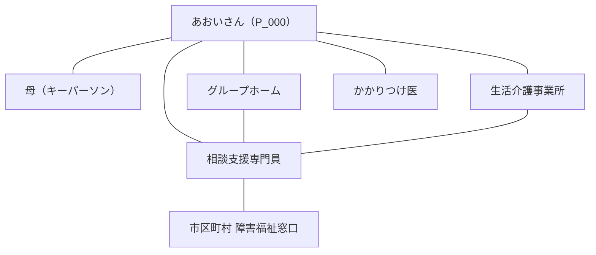

# あおいさんのエコマップ — 現況 (2026-06)

> 架空の記入例です（→ [[0_この記入例について]]）。支援ネットワークのスナップショット。関係が変わったら新しい月のページを作り、変化を追います。

## 用途

- [x] current — 現況把握
- [ ] handover — 引き継ぎ用
- [ ] crisis — 緊急時連絡網
- [ ] meeting — 支援会議資料

## ネットワーク図

## 関係性の質（凡例）

- 太線: 強い関係（日常的に密に関わる）
- 細線: 通常の関係
- 点線: 弱い関係 / 緊張関係

## ノード詳細

### 本人
→ [[P_000_見本_あおい]]

### 関わる人物・機関

- **母（キーパーソン）**: 本人を最もよく知る。暗黙知の主な語り手。高齢化が今後の課題。
- **グループホーム**: 居住の場。日々の入浴・睡眠などの関わり。
- **生活介護事業所**: 日中活動の場。
- **相談支援専門員**: サービス等利用計画を作成。各機関のハブ。
- **かかりつけ医**: 体調管理・服薬。
- **市区町村 障害福祉窓口**: 受給者証・各種申請。

> 💡 実際の運用では、各機関の Entity ページ（`wiki/entities/`）を作り、`[[E_...]]` でリンクすると、機関ごとの申し送りも蓄積できます。

## 変化点（前回スナップショットからの差分）

- 初回作成のため差分なし。

## 想定される将来の移行

- 母の高齢化に備え、キーパーソン機能を相談支援専門員・後見人等へどう引き継ぐかが今後の論点。
