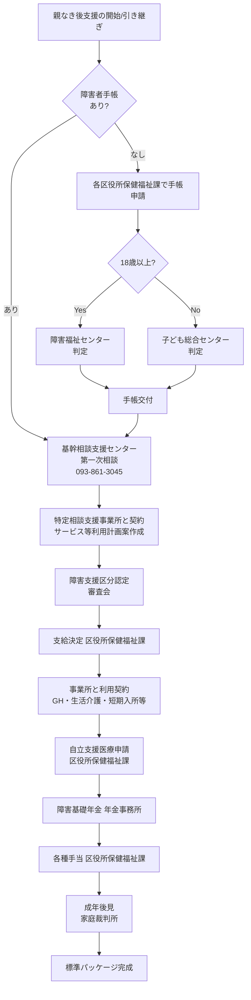
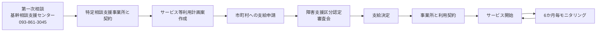

# 北九州市 親なき後の窓口経路（手続きフロー）

> 親なき後支援を組み立てる際に、本人を取り巻く各種手続きを北九州市の体制に沿ってどう順序立てるかを示すフローチャート。**「困ったときに最短で動けるための手順書」**として作成。

## 適用条件

- 北九州市に在住する知的障害（および精神障害・身体障害）のある方を支援する場面
- 親なき後の支援体制を新規構築する、または既存体制を引き継ぐ場面
- 緊急時に各窓口に連絡を取る必要がある場面

## 必要なもの・前提

- 本人のマイナンバーカード等の本人確認書類
- 既存の障害者手帳（あれば）
- 障害基礎年金関連書類（あれば）
- 過去のサービス等利用計画（あれば）
- 連絡先一覧 → 詳細は raw/legal/D_北九州市障害福祉 および北九州市障害福祉ガイド令和7年度版「23. 各区役所の窓口電話番号一覧」

## 1. 全体フロー



## 2. 手帳取得フロー

| 対象 | 申請窓口 | 判定機関 |
|------|----------|----------|
| 療育手帳（18歳以上） | 各区役所保健福祉課 | E_北九州市障害福祉センター（アシスト21内） |
| 療育手帳（18歳未満） | 各区役所保健福祉課 | 子ども総合センター（ウェルとばた5階） |
| 身体障害者手帳 | 各区役所保健福祉課（高齢者・障害者相談係） | 指定医師の診断書経由・北九州市長交付 |
| 精神障害者保健福祉手帳 | 各区役所保健福祉課（高齢者・障害者相談コーナー） | — |

詳細: PS_障害者手帳制度

## 3. サービス利用・相談支援契約フロー



詳細: PS_障害福祉サービス体系

## 4. 緊急時対応フロー

### 最優先連絡先（24時間対応）

1. **基幹相談支援センター**: **093-861-3045**（24時間対応）
2. **24時間子ども相談ホットライン**: **093-881-4152**（24時間365日、子どもに関する緊急相談）
3. **救急: 119** / **警察: 110**

### 状況別の連絡先

| 状況 | 連絡先 |
|------|--------|
| パニック・体調急変 | まずGH世話人/施設職員 → 基幹相談支援センター → 主治医 |
| 養護者の急病・緊急 | 基幹相談支援センター（24時間） |
| 虐待の疑い | 基幹相談支援センター → 北九州市障害者支援課 (093-582-2424) → 北九州市障害者虐待防止センター |
| 経済的困窮 | 各区役所保健福祉課いのちをつなぐネットワークコーナー |
| こころの悩み | 北九州市精神保健福祉センター（093-522-0874） |
| 住居喪失 | ホームレス自立支援センター北九州（一時生活支援） |

## 5. 親なき後の引き継ぎ準備チェックリスト

```
■ 経済的安定（年金・手当・扶養共済）
   - [ ] 障害基礎年金受給状況の確認・引き継ぎ書類整備
   - [ ] 特別障害者手当の受給状況・在宅要件の確認
   - [ ] 心身障害者扶養共済への加入（親が判断能力を有するうちに）
   - [ ] 障害年金生活者支援給付金の受給状況確認
   → PS_障害年金手当

■ 住まい（GH・施設・一人暮らし支援）
   - [ ] 親なき後の住居先の決定（GH・自立生活援助等）
   - [ ] 緊急時の短期入所先の確保
   - [ ] サテライト型住居の検討（一人暮らし希望時）
   → PS_障害福祉サービス体系

■ 意思決定支援（成年後見・日常生活自立支援事業）
   - [ ] 本人の判断能力の現状評価
   - [ ] 成年後見人の候補者選定（身上保護重視）
   - [ ] 親と専門職の複数後見の検討
   - [ ] 任意後見契約の可能性検討（本人の判断能力要件）
   → PS_成年後見制度

■ 医療継続（自立支援医療・北九州市重度心身障害者医療費助成）
   - [ ] 主治医・医療機関の引き継ぎ書類整備
   - [ ] 自立支援医療受給者証の更新管理
   - [ ] 服薬管理体制の確立
   → PS_自立支援医療

■ 相談・支援ネットワーク
   - [ ] 基幹相談支援センターへの登録・面談
   - [ ] 特定相談支援事業所の選定
   - [ ] サービス等利用計画の見直し
   - [ ] 緊急連絡先一覧の関係者間共有
   → E_北九州市障害者基幹相談支援センター

■ 文書・情報の整理
   - [ ] 各種手帳のコピー
   - [ ] 過去の医療情報・診断書
   - [ ] 過去のサービス等利用計画・モニタリング記録
   - [ ] 本人の人格・好み・嫌い・トリガー（本Vault wiki/persons/, wiki/triggers/）
```

## 6. 主要な連絡先一覧

| 機関 | 役割 | 電話 | 対応時間 |
|------|------|------|----------|
| **北九州市障害者基幹相談支援センター** | 第一次相談・24時間 | **093-861-3045** | 24時間（電話） |
| 北九州市障害者支援課 | 行政上の障害福祉サービス窓口 | 093-582-2424 | 平日8:30-17:15 |
| 北九州市障害福祉企画課 | 障害福祉ガイド等 | 093-582-2453 | 平日8:30-17:15 |
| E_北九州市障害福祉センター | 18歳以上療育手帳判定・障害支援区分審査会 | （アシスト21内） | 平日 |
| 子ども総合センター | 18歳未満療育手帳判定 | 093-881-5055（判定予約） | 平日 |
| 北九州市精神保健福祉センター | こころの悩み | 093-522-0874 | 平日 |
| 北九州市社会福祉協議会 | 生活福祉資金・日常生活自立支援事業 | 093-882-4405 | 平日 |
| 24時間子ども相談ホットライン | 子どもに関する緊急相談 | 093-881-4152 | 24時間365日 |

## 関連 Public System

- PS_障害者手帳制度
- PS_障害福祉サービス体系
- PS_障害年金手当
- PS_自立支援医療
- PS_成年後見制度
- PS_日常生活自立支援事業
- PS_障害者虐待防止法

## 関連 Entity

- E_北九州市障害福祉行政組織
- E_北九州市障害者基幹相談支援センター
- E_北九州市障害福祉センター

## 過去の事例・申し送り

（Phase 2 でパイロット対象決定後、実際のフローを通じての気づきや工夫を Trial として蓄積）

## 出典

- raw/legal/D_北九州市障害福祉
- raw/legal/A_手帳年金手当
- raw/legal/B_障害福祉サービス
- raw/legal/C_医療権利擁護
