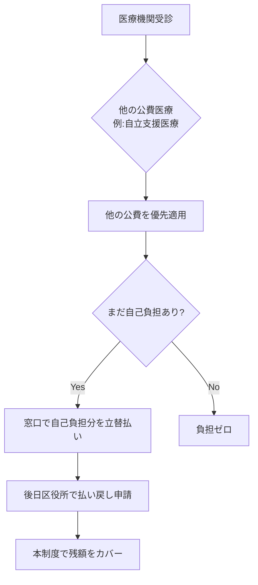

# 北九州市 重度心身障害者医療費助成制度

> 北九州市福祉医療支給制度の一環として、**保険診療による自己負担額の全額**を助成する北九州市独自の上乗せ制度。PS_自立支援医療 と組み合わせることで、知的障害のある方の医療継続を経済的に強力に支える。**療育手帳A表示・身体1〜2級・精神1級**が対象。

## 制度の概要

### 目的

重度障害者の健康の保持及び福祉の増進をはかるため、保険診療による医療費の自己負担額を助成する制度。

### 北九州市福祉医療支給制度の中の位置付け

```
北九州市福祉医療支給制度
├── 重度障害者医療費支給制度（本制度）
├── ひとり親家庭等医療費支給制度
└── 子ども医療費支給制度
```

## 対象者

### 障害種別・等級要件

| 手帳種別 | 対象 |
|----------|------|
| 身体障害者手帳 | **1級または2級** |
| 療育手帳 | **A表示**（B表示は対象外） |
| 精神障害者保健福祉手帳 | **1級** |

### その他の要件

- 北九州市内に住所を有し、健康保険に加入していること
- 65歳以上で**後期高齢者医療に加入していない人**は対象外
- 生活保護を受けている人は対象外
- **所得制限あり**: 前年所得（1月〜9月の申請は前々年所得）から一定の控除額を差し引いた額が、所得制限限度額（扶養親族0人で459万6千円等）以上は対象外

## 助成内容

- **助成範囲**: 保険診療による自己負担額の**全額**
- **助成対象外**:
  - 精神病床への入院医療費（精神保健福祉手帳1級の人。ただし18歳到達日以後の最初の3月31日までは無料）
  - 入院時の食事代等（標準負担額）
  - 保険診療以外の医療費（差額ベッド代・健康診断・予防接種・選定療養費・保険診療外の歯科治療費等）
- **後発医薬品（令和6年10月から）**: 後発医薬品がある薬で先発医薬品の処方を希望する場合は、特別の料金（先発薬と後発薬の価格差の4分の1相当）の自己負担が発生し、保険適用外（助成対象外）

## 申請窓口・必要書類

- **申請窓口**: 住所地の区役所保健福祉課 高齢者・障害者相談係
- **必要書類**:
  - 本人確認書類（マイナンバーカード等）
  - 健康保険情報が確認できるもの
  - 身体障害者手帳・療育手帳・精神障害者保健福祉手帳
  - 市外から転入した人はマイナンバー確認書類及び本人確認書類（または前住所地の市町村発行の所得額証明書）

## 受給者証の運用

### 転入時の特例

- 転入の日の翌日から**15日以内**に手続きをすると「**転入の日から有効**」
- 15日を経過すると「申請月の初日から有効」に切り替わる
- GHへの市外からの転入時は要注意

### 自動更新

- 毎年原則10月に自動更新
- ただし以下は自動更新されない:
  - 所得超過になった方
  - 所得や手帳の等級（表示）の確認ができない方
  - 65歳を迎える方
  - **精神保健福祉手帳の有効期限を迎える方**

## 自立支援医療等他制度との関係

### 併用時の優先順位

他の公費医療（自立支援医療等）がある場合は、医療機関の窓口に医療証とあわせて提示。**他の公費医療が優先適用** → 残った自己負担分を本制度でカバー。

### 一般的な医療費負担のフロー



### 払い戻し手続きの期限

- 原則: 支払いの翌日以降5年で時効
- **保険証未提示による10割負担や装具作成時**は、健康保険への申請期間がさらに短い → 立替払い後の迅速な請求サポートが必要

## 親なき後支援の文脈での活用ポイント

### 知的障害のある方が利用する際の留意点

- 療育手帳で対象になるのは **A表示** のみ。B表示の方は対象外（重度の判定基準を満たさない）
- 受診時には「**健康保険情報**」と「**重度障害者医療証**」の両方の提示が必要
- 自立支援医療等を併用する場合はその受給者証もあわせて提示 → **支援者が複数の証類を確実に管理・提示するサポートが不可欠**

### 申請忘れ防止チェックリスト

- [ ] 転入時の15日以内ルール（市外からのGH転入時）
- [ ] 精神保健福祉手帳の有効期限切れと連動した受給者証の自動更新例外
- [ ] 65歳到達時の自動更新例外
- [ ] 住所・氏名・健康保険変更時の届出
- [ ] 立替払い時の迅速な払い戻し請求

## 関連 Public System

- PS_自立支援医療: 併用で自己負担をさらに軽減
- PS_障害者手帳制度: 等級・表示要件
- PS_障害福祉サービス体系: GH 等の利用と医療継続の組み合わせ

## 関連 Entity

- E_北九州市障害福祉行政組織: 各区役所保健福祉課が窓口

## 関連 Procedure

- PC_北九州市親なき後窓口経路

## 出典

- raw/legal/E_北九州市重度心身障害者医療費助成
- 北九州市 重度障害のある方へ医療費を助成します: https://www.city.kitakyushu.lg.jp/contents/924_10698.html
- 北九州市福祉医療支給制度: https://www.city.kitakyushu.lg.jp/kurashi/menu01_0256.html
- 北九州市 医療費の助成など: https://www.city.kitakyushu.lg.jp/category/menu00_0070.html
